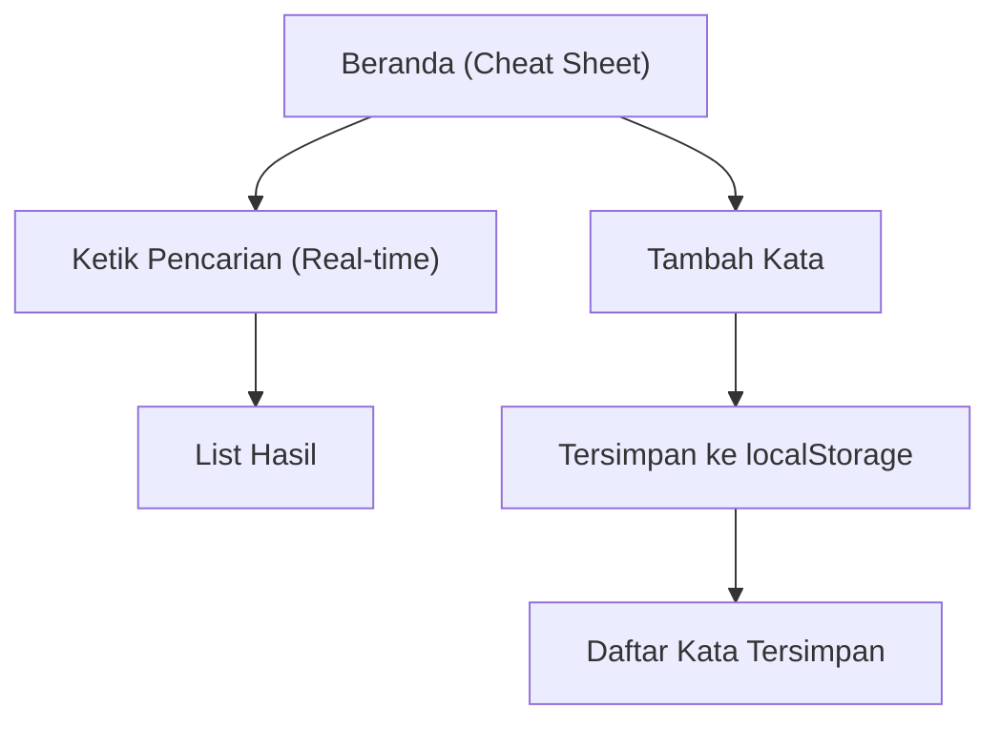

## 1. Product Overview
Web app “Cheat Sheet Sambung Kata” untuk membantu kamu mencari kata/frasanya secara cepat saat bermain sambung kata.
Fokus utama: pencarian real-time, daftar hasil, dan menambah kata favorit yang tersimpan di localStorage.

## 2. Core Features

### 2.1 Feature Module
Produk terdiri dari halaman utama berikut:
1. **Beranda (Cheat Sheet)**: input pencarian real-time, list hasil, form tambah kata, daftar kata tersimpan.

### 2.2 Page Details
| Page Name | Module Name | Feature description |
|-----------|-------------|---------------------|
| Beranda (Cheat Sheet) | Header & Judul | Menampilkan judul aplikasi dan deskripsi singkat fungsi. |
| Beranda (Cheat Sheet) | Pencarian real-time | Memfilter daftar kata saat kamu mengetik (tanpa tombol submit); menampilkan state kosong bila tidak ada hasil. |
| Beranda (Cheat Sheet) | List hasil | Menampilkan hasil yang cocok dalam bentuk list; menampilkan jumlah hasil. |
| Beranda (Cheat Sheet) | Tambah kata | Menambahkan kata baru ke koleksi tersimpan melalui input + aksi simpan; validasi sederhana (tidak boleh kosong). |
| Beranda (Cheat Sheet) | Kata tersimpan (localStorage) | Memuat daftar kata tersimpan saat halaman dibuka; menyimpan perubahan ke localStorage agar persist di browser yang sama. |

## 3. Core Process
**Alur utama (Pengguna):**
1. Kamu membuka Beranda.
2. Aplikasi memuat kata tersimpan dari localStorage.
3. Kamu mengetik di kolom pencarian.
4. Aplikasi memfilter dan menampilkan list hasil secara real-time.
5. Kamu menambahkan kata baru melalui form tambah kata.
6. Aplikasi menyimpan kata tersebut ke localStorage dan memperbarui daftar kata tersimpan.

