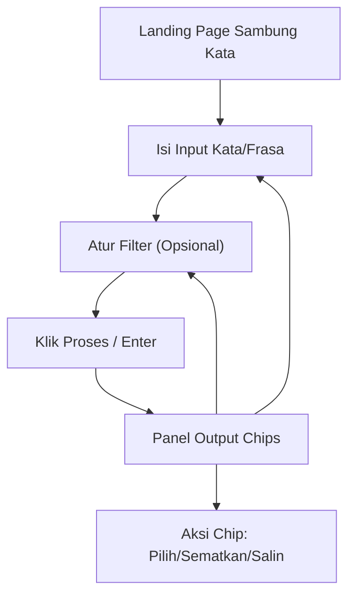

## 1. Product Overview
Redesign landing page “Sambung Kata” agar lebih jelas, cepat dipahami, dan terasa modern.
Struktur konten mengikuti referensi (header futuristik, status badges, input+filter, output chips) namun dengan gaya visual baru.

## 2. Core Features

### 2.1 Feature Module
Landing page requirements terdiri dari halaman berikut:
1. **Landing Page Sambung Kata**: header futuristik (versi baru), status badges, area input + filter, panel output berupa chips, dan kontrol aksi utama.

### 2.3 Page Details
| Page Name | Module Name | Feature description |
|-----------|-------------|---------------------|
| Landing Page Sambung Kata | Header / Hero | Menampilkan judul produk, subjudul singkat, serta 1 CTA utama untuk memulai proses sambung kata. |
| Landing Page Sambung Kata | Status Badges | Menampilkan status ringkas dan dapat dipindai cepat (mis. mode aktif, jumlah hasil, validasi input) sebagai badges. |
| Landing Page Sambung Kata | Area Input | Mengisi kata/frasa awal; menjalankan aksi “Proses” via tombol atau enter; menampilkan state loading/disabled saat memproses. |
| Landing Page Sambung Kata | Area Filter | Mengubah parameter keluaran (mis. panjang kata, kategori/tema, batas hasil) melalui kontrol ringkas; reset ke default. |
| Landing Page Sambung Kata | Panel Output Chips | Menampilkan hasil sebagai chips; mendukung aksi cepat per-chip (pilih/sematkan/salin); mendukung state kosong dan error. |
| Landing Page Sambung Kata | Notifikasi & Error State | Menampilkan pesan kesalahan yang bisa ditindaklanjuti (input tidak valid, tidak ada hasil, gagal proses) dengan CTA perbaikan. |

## 3. Core Process
**Alur Pengguna (Landing Page):**
1. Kamu membuka landing page dan melihat header + status badges.
2. Kamu mengetik kata/frasa awal pada area input.
3. Kamu (opsional) mengatur filter parameter keluaran.
4. Kamu menekan tombol Proses/Enter.
5. Sistem menampilkan hasil pada panel output chips.
6. Kamu menyalin atau memilih chip tertentu; kamu bisa mengubah input/filter dan memproses ulang.

