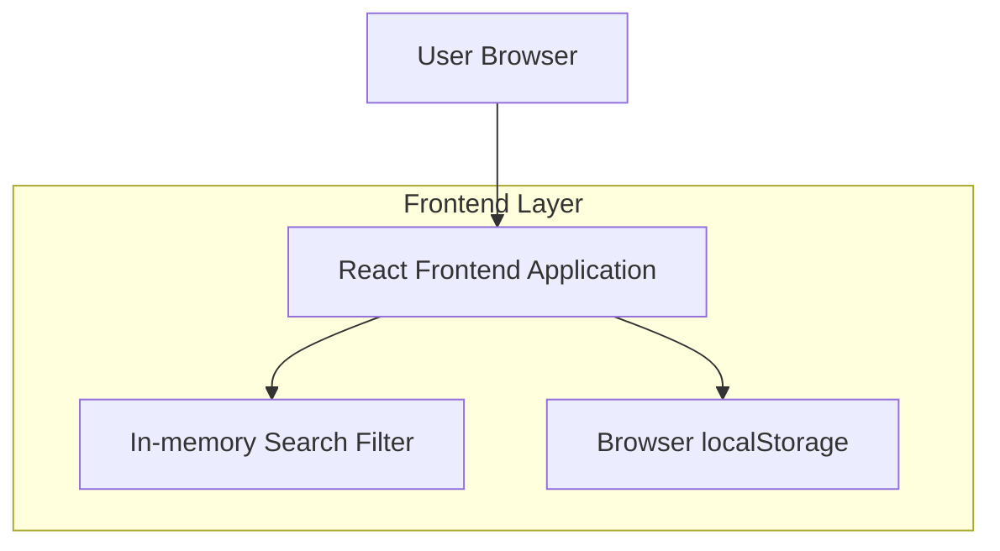

## 1.Architecture design

## 2.Technology Description
- Frontend: React@18 + TypeScript + vite
- Styling: tailwindcss@3 (opsional, untuk percepat UI)
- Backend: None (semua berjalan di browser)
- Storage: Browser localStorage (persist kata tersimpan)

## 3.Route definitions
| Route | Purpose |
|-------|---------|
| / | Beranda: pencarian real-time, list hasil, tambah kata, dan daftar kata tersimpan (localStorage) |

## 6.Data model(if applicable)
### 6.1 Data model definition
Penyimpanan menggunakan localStorage (bukan database). Struktur data yang disarankan:
- `saved_words`: array of string (contoh: `["kata1", "kata2"]`)

### 6.2 Data Definition Language
Tidak ada DDL karena tidak memakai database.
